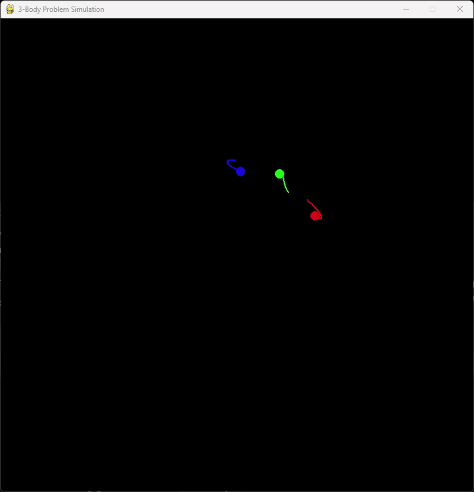

### N-Body Gravitational Simulator 💫

[](#) [](#) [](LICENSE)

<p>
  
</p>

## 👑 Table of Contents

- [👑 Table of Contents](#-table-of-contents)
- [🧐 Overview](#-overview)
- [📐 Physics Theory](#-physics-theory)
- [⚙️ Numerical Methods](#️-numerical-methods)
- [📊 Key Parameters](#-key-parameters)
- [🌌 Example Simulations](#-example-simulations)
- [👨💻 User Input \& Usage Instructions](#-user-input--usage-instructions)
- [📳 Installation](#-installation)
- [🔍 Troubleshooting](#-troubleshooting)
- [📝 Observations \& Considerations](#-observations--considerations)
- [📚 References](#-references)
- [🏗️ Future Enhancements](#️-future-enhancements)

## 🧐 Overview

This repository provides a Python-based **N-body gravitational simulator** that displays real-time visualizations of celestial bodies interacting under Newtonian gravity. It focuses on three core elements:

- Direct `O(n^2)` calculation of gravitational forces between all pairs of bodies.
- Simple Euler integration to advance each body's position and velocity.
- An interactive, user-configurable simulation loop with Pygame-based visuals.

<blockquote>
The aim is to offer a straightforward, educationally oriented approach to gravitational simulation. It illustrates concepts in numerical analysis and classical mechanics while being easy to modify for experimentation.
</blockquote>

---

## 📐 Physics Theory

The physics framework for this simulation is rooted in Newton's laws of motion and universal gravitation. Key equations include:

1. **Newton's Law of Universal Gravitation:**

    ```math
    F = G \frac{m_1 m_2}{r^2}
    ```

   - `F` is the magnitude of the gravitational force, `G` the gravitational constant, and `r` the distance between two masses `m_1` and `m_2`.

2. **Equations of Motion:**

    ```math
    a_x = \frac{F_x}{m}, \quad a_y = \frac{F_y}{m}
    ```

   - `a_x` and `a_y` are the accelerations, while `F_x` and `F_y` are the components of the force `F`.

3. **Numerical Integration (Euler Method):**

    ```math
    v_{new} = v_{old} + a \cdot \Delta t
    ```

   - Positions are updated likewise: `x_{new} = x_{old} + v_x \cdot \Delta t`, `y_{new} = y_{old} + v_y \cdot \Delta t`.
   - This explicit method is easy to implement but can suffer from accumulating numerical errors over time.

---

## ⚙️ Numerical Methods

Script compute gravitational interactions using a simple, direct `O(n^2)` algorithm where every body calculates forces with every other body. The primary components of the code are:

| Component | Implementation Details |
|----------|-----------------------|
| **Gravity Calculation** | Direct N-body `O(n^2)`  algorithm |
| **Integration Scheme** | Euler Method (first-order) |
| **Collision Handling** | Softened potential (Plummer model) |

The `SOFTENING` term prevents excessive forces when two bodies are very close. Although this lacks true collision detection, it keeps the simulation stable.

---

## 📊 Key Parameters

All core parameters are specified in the code (e.g. `physics.py` or in `main.py`):

```python
# Fundamental constants
G = 6.67430e-2   # Scaled gravitational constant [pixel³ kg⁻¹ s⁻²]
DT = 0.01       # Time step for Euler integration [s]

# Numerical stability
SOFTENING = 10.0 # Minimum distance to prevent singularities [pixels]
MARGIN = 100   # Boundary margin for auto-reset [pixels]

# Visualization
TRAIL_LENGTH = 100   # Trail history length
PARTICLE_RADIUS = 8   # Body radius [pixels]
BG_COLOR = (0, 0, 0) # Background color
```

**Tip:** Adjusting `G`, `DT`, and `SOFTENING` can dramatically change how the simulation evolves.

---

## 🌌 Example Simulations

1. **Stable Binary System**

   - Two bodies of equal mass in a near-circular orbit around their center of mass.
   - Adjust initial velocities to see elliptical paths or stable circles.

2. **Chaotic Triple System**

   - 3 bodies with different masses: observe possible fly-by events or ejections if one body escapes the gravitational pull of the others.
   - Small changes in initial conditions can yield drastically different outcomes.

3. **Galactic Core Simulation**

   - Multiple bodies with one dominant mass (acting as a central "black hole").
   - Shows how orbits become tightly bound to a heavy central object.

---

## 👨💻 User Input & Usage Instructions

1. You will be prompted to enter the **number of bodies** (`num_bodies`), ranging from 2 to 10.
2. You can choose whether to **generate masses randomly** or provide them manually (e.g. if you want to control mass values).
3. After configuration, the simulation **automatically randomizes positions and velocities**, offset by the center of mass velocity for stability.
4. When all bodies move outside the view rectangle plus the defined `MARGIN`, the simulation **restarts** with new initial conditions.
5. Close the Pygame window or press `Esc` to exit.

    **Visual Elements:**

   - Each body has a distinct HSV-based color.
   - Trails are drawn to indicate past positions, fading as they grow older.
   - You can customize window size, frames per second, and particle radius if desired.

---

## 📳 Installation

To install and run this simulation:

```bash
# Clone the repository
git clone https://github.com/destrudos/nbody-sim.git
cd nbody-sim

# Install requirements
pip install -r requirements.txt

# Start the simulation
python main.py
```

**Prerequisites:**

- Python 3.8+
- Pygame 2.1.3+
- A system capable of rendering a simple Pygame window in real time.

---

## 🔍 Troubleshooting

- `Bodies escape too fast`:
  - Lower the gravitational constant `G`.
  - Increase the `SOFTENING` parameter.
  - Use a smaller time step `DT`.

- `Low performance`:
  - Reduce `num_bodies` or shorten `TRAIL_LENGTH`.
  - Consider running the simulation in a lower resolution window.
  - Optimize by commenting out trail rendering or exploring GPU acceleration.

---

## 📝 Observations & Considerations

- **Chaotic Behavior:** N-body systems are famously chaotic when `n` > 2. Small differences in initial conditions lead to exponential divergences in the trajectories.
- **Euler Method Limitations:** This first-order integration method can produce substantial drift or energy non-conservation over long runs.
- **Performance Trade-Offs:** A direct `O(n^2)` solution is simple but becomes costly as `n` increases.
- **Rational Opinion:** For educational demos, this is an excellent tool. In cases requiring long-term, high-precision astronomical studies, one should pursue more sophisticated algorithms (e.g. Runge-Kutta 4th order, Verlet, Barnes-Hut).

---

## 📚 References

1. Newtonian Dynamics - R. Fitzpatrick
2. Computer Simulation Using Particles - R.W. Hockney
3. Numerical Recipes - W.H. Press et al.
4. Classical Mechanics - H. Goldstein

---

## 🏗️ Future Enhancements

- **Higher-Order Integrators:** Implement Verlet, Leapfrog, or Runge-Kutta 4 for greater accuracy and energy conservation.
- **Collision Merging:** Combine masses when bodies meet within a certain radius, conserving momentum.
- **Adaptive Time Stepping:** Use smaller time steps when two bodies are close to improve accuracy.
- **Barnes-Hut or Octree Methods:** Optimize gravitational calculations to achieve near `O(n log n)` performance.
- **GPU Acceleration:** Leverage CUDA or OpenCL to handle force computations in parallel, enabling larger `n`.

**Have fun exploring the vast possibilities of gravitational dynamics!**
